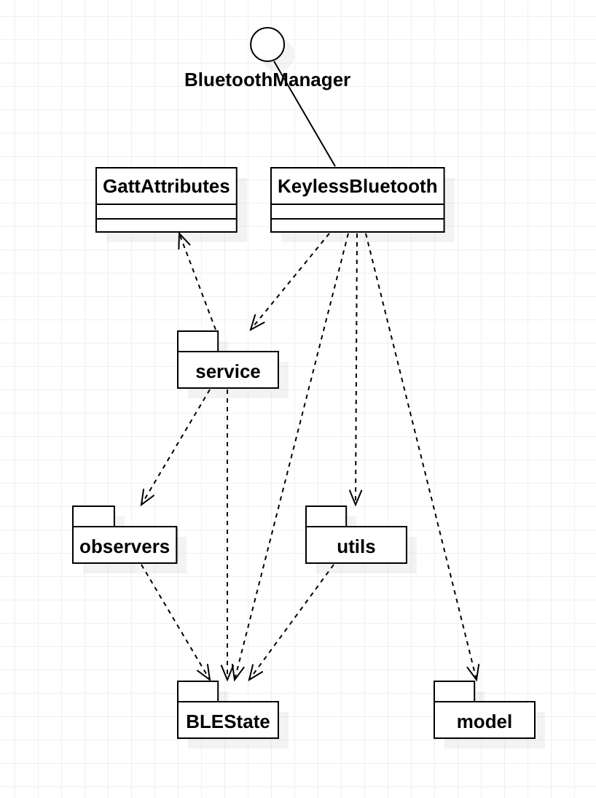
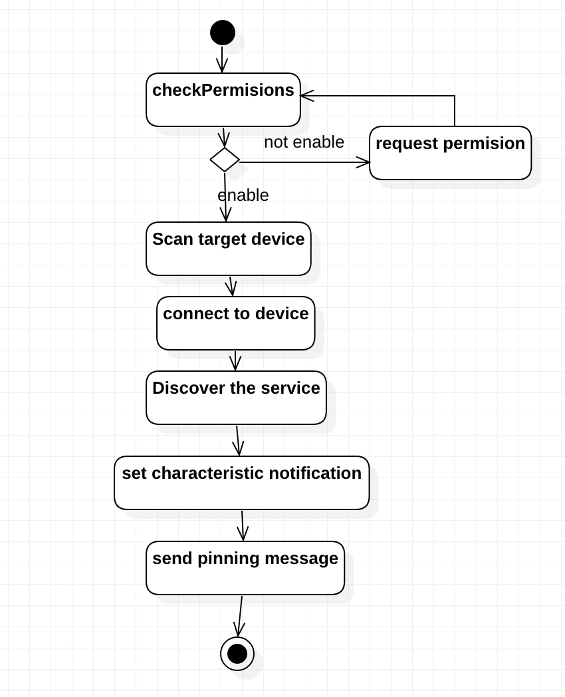

# Keyless BLE

## Features
- Gestionar los procesos de busqueda, discubrimiento de servicios, conexión.
- Gestionar los permisos necesarios para usar bluetooth
- Observar los cambios de estados de bluetooth, gps, conexión, permisos necesarios.
- Reconectar con los datos de ultimo remote.
- Personalizar los protocolos de comunicaciones.
- Logging

## Arquitectura


### Responsabilidades
- `BLEState` clases de variables constantes para los estados
	- bluetooth abilidad 
	- resultados de permisons
	- gps conexión
	- BLEGatt conexión
	- bluetooth actividad
- `model` clases de bluetooth dispositivo remote
	- Guardar bluetooth dispositivo y utilizarlo en reconectar.
- `utils` clases de log y permisos
	- Imprimir logs en el modo de debug, para detallar los procesos de bluetooth.
	- Gestionar los permisos para usar bluetooth.
- `service` clases de servicios de bluetooth conexión, cada conexión es un servicio.
	- Construyen y destruyen el servicio de bluetooth conexión
	- Desarrollan el processo de conectar, desconectar, escribir a caracteristica, 
	- Escuchan los cambios de estado de la conexión y los contenidos de  caracteristica
	- Emitan los cambios de Gatt a los observers
- `observers` clases de los observers
	- Escuchan cambios de Gatt
	- Escuchan cambios de bluetooth actividad
- `listeners` interfaces para escuchar los cambios en el proceso de conexión o los cambios de estados
	- Escuchar cambios de estados de conexión entre android y remote
	- Escuchar cambios de actividades de bluetooth
	- Escuchar cambios de actividades de gps
	- Escuchar cambios de resultados de los permisos necesarios
	- Escuchar cambios de abilidad de blutooth
	- Realizar pediciones a usarios de los permisos necesarios
	- Escuchar las repuestas de remote
	- Escucahr resultados de la buscqua de objetivo remote
- `GattAttibutes` clase de variables constantes de UUID en la conexión bluetooth
	- UUID para el servicio
	- UUID para el caracteristica
	- UUID para el descriptor de caracteristicas que abilitar la notificación de los repuestas de remote
- `BluetoothManager y KeylessBluetooth` 
	- BluetoothManager es una interfaz que usa el cliente para gestionar el proceso de bluetooth, está en el nivel más arriba.
	- KeylesssBluetooth es una class abstacta que implementa la interfaz, realiza los procesos como buscar, conectar y desconectar el cliente puede crear una clase que se hereda a ella para realizar protocolos propios, se trada de la comunicación con el remote y la logica de negocio.

## BLE Conexión Flujo


## Uso
1. Crear una clase de protocolo de bluetooth. 
2. Crear una clase hijo de KeylessManager, y realizar los metodos para implementar el protocolo. En el metodo del **onDataReceived()**, recive las repuestas de remote.
```
override fun onDataReceived(data: String) {
}
```
3. Crear una interfaz para la comunicación entre la vista y bluetooth manager.
4. En la clase GattAttributes, cambiar UUID para el servicio y caracteristica.

## Dependencias

- google location service
